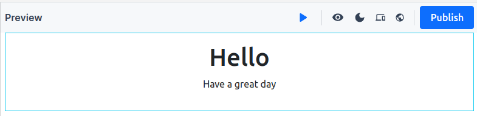
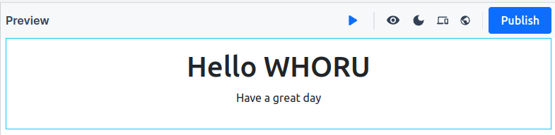

# Collegium-BOS-WK1
## 주제: 컴포넌트와 컴포지션 만들어보기
이번 과제는 이름을 입력하고 친근한 인사말을 렌더링하는 간단한 애플리케이션을 만듭니다.
## 1. 온라인 에디터 환경 접속하기
1. [nearpad](https://nearpad.dev/) 사이트에 접속해주세요.

2. TRY FOR FREE 버튼을 클릭해주세요.


3. [nearpad 편집기](https://nearpad.dev/editor)가 나타나는 것을 확인해주세요.


## 2. Greeter 컴포넌트 만들기
1. Crerate Widget 버튼을 클릭해주세요.


2. 연필 모양 아이콘을 클릭해주세요.


3. Untitled-1 컴포넌트의 이름을 "Greeter"로 바꿔주세요.
4. Rename 버튼을 클릭해주세요.


5. 위젯 이름이 Greeter로 변경된 것을 확인해주세요.


## 3. 지갑 연결하기
1. Connect 버튼을 클릭해주세요.


2. 사용할 지갑을 선택해주세요. (ex: NEAR Wallet을 선택)


3.Next 버튼을 클릭해주세요


4. Connect 버튼을 클릭해주세요.


## 4. Greeter 컴포넌트 렌더링하기
1. .아래 코드를 Greeter 컴포넌트의 코드에 추가해주세요.
``` jsx
let greeting = "Have a great day";

return (
  <>
    <div class="container border border-info p-3 text-center">
      <h1>Hello {props.name}</h1>

      <p> {greeting} </p>
    </div>
  </>
);

```
2. Preview 탭에 `Hello have a great day`를 표시하는 화면을 확인해주세요.



## 5. Greeter 컴포넌트에 Props를 전달하기
1. Props 탭을 선택해주세요.


2. props 에디터에 아래 내용을 추가해주세요.
``` json
{
  "name": "WHORU"
}
```
3. Preview 탭에 표시되는 화면이 바뀐것을 확인해주세요.



## 6. Greeter 컴포넌트 배포하기
1. Publish 버튼을 클릭해주세요.


2. Saving data 대화 상자가 나타나는 것을 확인해주세요.


3. Save Data 버튼을 클릭해주세요.


4. My Widgets에 `Greeter` 컴포넌트가 추가된 것을 확인해주세요.


## 6. Composition 컴포넌트 만들기

## 7. Greeter 컴포넌트를 불러오기
